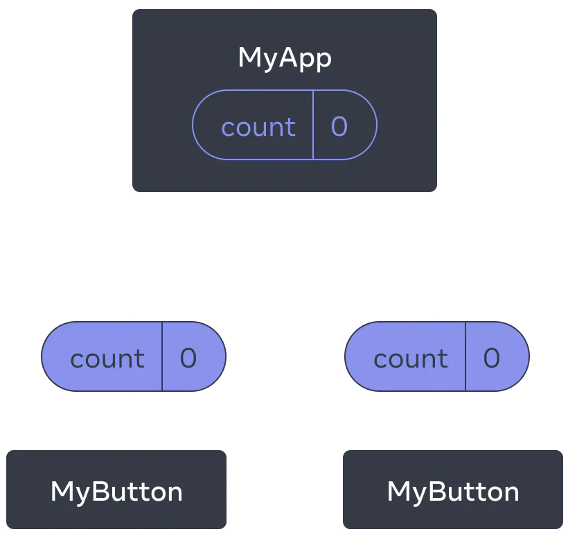
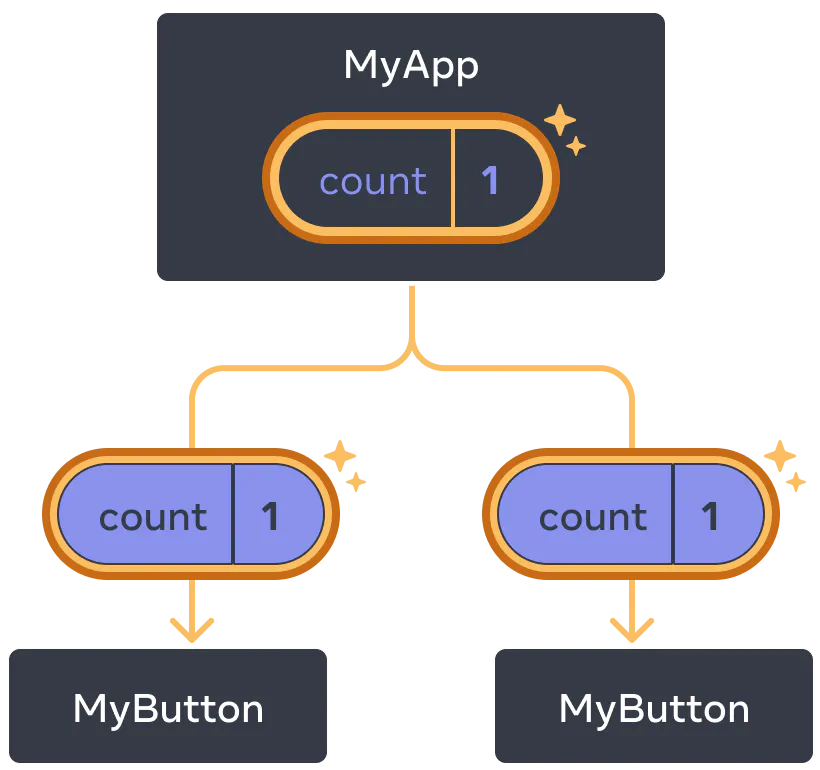

# JavaScript Learning

## 学习网站

### [https://zh-hans.react.dev/learn/tutorial-tic-tac-toe](https://zh-hans.react.dev/learn/tutorial-tic-tac-toe)

## 快速入门

### 创建和嵌套组件
React 组件必须以大写字母开头，而 HTML 标签则必须是小写字母

React 组件是返回标签的 JavaScript 函数
```javascript
function MyButton() {
  return (
    <button>I'm a button</button>
  );
}
```
在声明一个组件后，嵌套到另一个组件
```javascript
export default function MyApp() {
  return (
    <div>
      <h1>Welcome to my app</h1>
      <MyButton />
    </div>
  );
}
```

### 使用 JSX 编写标签

JSX 比 HTML 更加严格,必须闭合标签,将组件包裹到一个共享的父级中，比如 &lt;div&gt;...&lt;/div&gt; 或使用空的 <>...</> 包裹

### 添加样式
在 React 中，你可以使用 className 来指定一个 CSS 的 class。它与 HTML 的 class 属性的工作方式相同
```jsx

```

### 显示数据
JSX 会让你把标签放到 JavaScript 中。而大括号会让你 “回到” JavaScript 中，这样你就可以从你的代码中嵌入一些变量并展示给用户
```jsx
return (
  <h1>
    {user.name}
  </h1>
);
```
使用大括号将 JSX 属性 “转义到 JavaScript”例如，className="avatar" 是将 "avatar" 字符串传递给 className，作为 CSS 的 class。但 src={user.imageUrl} 会读取 JavaScript 的 user.imageUrl 变量，然后将该值作为 src 属性传递
```jsx
return (
  
);
```

### 条件渲染
使用 JavaScript 代码
```js
let content;
if (isLoggedIn) {
  content = <AdminPanel />;
} else {
  content = <LoginForm />;
}
return (
  <div>
    {content}
  </div>
);
```

### 渲染列表
```js
const products = [
  { title: 'Cabbage', id: 1 },
  { title: 'Garlic', id: 2 },
  { title: 'Apple', id: 3 },
];
```
```js
const listItems = products.map(product =>
  <li key={product.id}>
    {product.title}
  </li>
);

return (
  <ul>{listItems}</ul>
);
```

### 响应事件
onClick={handleClick} 的结尾没有小括号，只需要把函数传递给事件
```js
function MyButton() {
  function handleClick() {
    alert('You clicked me!');
  }

  return (
    <button onClick={handleClick}>
      Click me
    </button>
  );
}
```

### 更新界面
首先，从 React 引入 useState
```js
import { useState } from 'react';
```

在组件中声明一个 state 变量,从 useState 中获得当前的 state（count），以及用于更新它的函数（setCount）
```js
function MyButton() {
  const [count, setCount] = useState(0);

  function handleClick() {
    setCount(count + 1);
  }

  return (
    <button onClick={handleClick}>
      Clicked {count} times
    </button>
  );
}
```
如果多次渲染同一个组件，每个组件都会拥有自己的 state
```html
import { useState } from 'react';

export default function MyApp() {
  return (
    <div>
      <h1>Counters that update separately</h1>
      <MyButton />
      <MyButton />
    </div>
  );
}
```

### 使用Hook

以use开头的函数被称为Hook，只能在组件中的顶层中调用 [Hook](https://react.docschina.org/reference/react)

### 组件中共享数据
在 [前面的示例中](#响应事件) 每个MyButton都有自己独立的count,为了使MyButton组件显示相同的count并一起更新，需要将各个按钮的state“向上”移动到最接近包含所有按钮的组件中


```html
export default function MyApp() {
  const [count, setCount] = useState(0);

  function handleClick() {
    setCount(count + 1);
  }

  return (
    <div>
      <h1>Counters that update together</h1>
      <MyButton count={count} onClick={handleClick} />
      <MyButton count={count} onClick={handleClick} />
    </div>
  );
}
function MyButton() {
  return (
    <button onClick={onClick}>
      Clicked {count} times
    </button>
  );
}
```