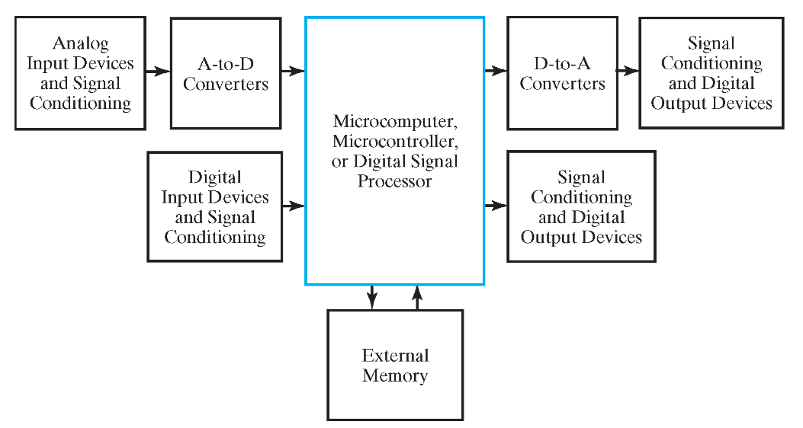

# 计算机逻辑设计基础

## 学长笔记

[计逻笔记](https://note.hobbitqia.cc/Logic/)
[数逻笔记(供参考)](https://note.isshikih.top/cour_note/D2QD_DigitalDesign/)

## [实验报告](https://github.com/HobbitQia/ZJU-Courses-Resources/blob/master/%E8%AE%A1%E7%AE%97%E6%9C%BA%E9%80%BB%E8%BE%91%E8%AE%BE%E8%AE%A1%E5%9F%BA%E7%A1%80/%E8%AE%A1%E9%80%BB%E5%AE%9E%E9%AA%8C%E6%8A%A5%E5%91%8A/%E8%AE%A1%E7%AE%97%E6%9C%BA%E9%80%BB%E8%BE%91%E8%AE%BE%E8%AE%A1%E5%9F%BA%E7%A1%80_%E8%AF%84%E5%88%86%E6%A0%87%E5%87%86%E4%B8%8E%E5%AE%9E%E9%AA%8C%E6%8A%A5%E5%91%8A%E6%A8%A1%E6%9D%BF.doc)

## 课程学习内容

课程主要介绍与计算机相关的数字电路的基本内容，涉及的知识有：进制转换与数字编码，基本逻辑门与逻辑方程，组合逻辑电路，时序逻辑电路，可编程逻辑结构，寄存器，内存等，帮助大家从晶体管级开始认识到计算机底层的逻辑电路的工作原理，为后续学习计算机组成和计算机体系结构打下基础

## 分数构成

* 作业：0%，自行完成，期中期末上交两次
* 平时实验：30%
* 课堂随机小测：25%

* project（课程设计）：15%
* 期末：30%（斩杀线 50 分）

## Digital Systems and Information

### Types of Digital Systems

* No state persent
<!-- 组合逻辑电路 -->

  * Combinational Logic System
  * Out put = FUncytion(Input)

* State present
<!-- 时序逻辑电路 -->
  * State updated at discrete times => Synchronous Sequential System
  * State updated at any times => Asynchronous Sequential System
  * State = Funstion(State,Input)
  <!-- 同步：周期更新 -->
  * Output= Function(State) = Funstion(State,Input)
  <!-- 异步：随时更新 -->

### Embedded Systems
<!-- 嵌入式系统 -->

* Block Diagram of Embedded Systems

* Example: Temperature Measurement and Display

* 香农采样定理
采样频率高于实际频率2倍时，可将采样后的信号恢复为原信号

### noise
二进制编码方式具有最高的噪声容限

### Binary Values

physical quantities represent 0 and 1

* CPU Voltage
* CD Surface Pits/Light

### Binary Arithmetic

* Single Bit Addition with Carry
* Multiple Bit Addition
* Single Bit Subtraction with Borrow
* Multiple Bit Subtraction
* Multiplication
* BCD Addition

### Numbers in Different Bases

* To Convert the Fractional Part

Repeatedly multiply the fraction by the new radix and save the integer digits that result.  The digits for the new radix are the integer digits in order of their computation.If the new radix is > 10, then convert all integers > 10 to digits A, B

### Octal (Hexadecimal) to Binary and Back

### ASCII Properties

* 94 Graphic printing characters
* 34 Non-printing characters
* Digits 0 to 9 span Hexadecimal values $30_{16}$ to $39_{16}$
* Upper case A-Z span $41_{16}$ to $5A_{16}$
* Lower case a-z span $61_{16}$ to $7A_{16}$
* Lower to upper case translation (and vice versa) occurs byflipping bit 6.

### Error Detection

* Redundanct,in the form of extra bits,can be incorporated into binary code words to detect and correct errors
* Parity
an extra bit appended onto the code word to make the number of 1’s odd or even.
Parity can detect all single-bit errors and some multiple-bit errors
  * A code word has even parity if the number of 1’s in the code word is even
  * A code word has odd parity if the number of 1’s in the code word is odd

* Gray code
